# Sistema de Controle de Pedidos e Entregas

Sistema de pedidos, registro de entregas e notificações em tempo real.

---

## Demonstração

> Os vídeos abaixo mostram o sistema funcionando. Para assistir, baixe ou abra diretamente pelo GitHub.

| Vídeo | Descrição |
|-------|-----------|
| [▶ Demonstração do Frontend](video/front.mkv) | Cadastro, login, criação de pedido com busca de CEP, registro de entrega e notificações em tempo real |
| [▶ Demonstração da API](video/api.mkv) | Endpoints REST via Swagger: autenticação JWT, criação de pedido, registro de entrega e notificações |


## Tecnologias utilizadas

### Backend
| Tecnologia | Para quê |
|-----------|----------|
| ASP.NET Core 9 | Framework da API REST |
| MongoDB | Banco de dados (pedidos, entregas, usuários, notificações) |
| SignalR | Notificações em tempo real via WebSocket |
| JWT (JSON Web Token) | Autenticação e proteção das rotas |
| Refit | Cliente HTTP tipado para consulta do ViaCEP |
| FluentValidation | Validação dos dados de entrada |
| Swagger | Documentação interativa da API |

### Frontend
| Tecnologia | Para quê |
|-----------|----------|
| Angular 19 | Framework do cliente web |
| Angular Material | Componentes de interface (formulários, tabelas, botões) |
| SignalR JS Client | Receber notificações em tempo real |

### Infraestrutura
| Tecnologia | Para quê |
|-----------|----------|
| Docker + Docker Compose | Sobe toda a aplicação com um único comando |
| Nginx | Serve o frontend em produção |

---

## Fluxo do sistema

```mermaid
flowchart TD
    A([Usuário acessa o sistema]) --> B{Tem conta?}
    B -- Não --> C[Preenche Nome, E-mail e Senha]
    C --> D[POST /api/users/register]
    D --> E[(MongoDB salva usuário)]
    E --> F[Redireciona para Login]
    B -- Sim --> F

    F --> G[Preenche E-mail e Senha]
    G --> H[POST /api/auth/login]
    H --> I{Credenciais válidas?}
    I -- Não --> G
    I -- Sim --> J[Recebe Token JWT]
    J --> K[Conecta ao Hub SignalR]
    K --> L[[Dashboard / Painel]]

    L --> M[Clica em Novo Pedido]
    M --> N[Preenche Descrição, Valor e CEP]
    N --> O[API consulta ViaCEP]
    O --> P{CEP encontrado?}
    P -- Não --> N
    P -- Sim --> Q[Endereço preenchido automaticamente]
    Q --> R[POST /api/orders]
    R --> S[(MongoDB salva pedido)]
    S --> T[SignalR envia notificação ORDER_CREATED]
    T --> U[🔔 Badge aparece no painel em tempo real]

    U --> V[Clica em Registrar Entrega]
    V --> W[Informa Número do Pedido e Data/Hora]
    W --> X[POST /api/deliveries]
    X --> Y{Pedido existe?}
    Y -- Não --> W
    Y -- Sim --> Z[(MongoDB salva entrega)]
    Z --> AA[SignalR envia notificação DELIVERY_REGISTERED]
    AA --> AB[🔔 Segunda notificação em tempo real]

    AB --> AC[Acessa painel de Notificações]
    AC --> AD[Marca como lida]
    AD --> AE[PATCH /api/notifications/id/read]
    AE --> AF[(MongoDB atualiza isRead)]
```



---

## Como rodar o projeto

### Pré-requisitos

Instale apenas:

- [Docker Desktop](https://www.docker.com/products/docker-desktop/) — necessário para subir tudo

Não é necessário instalar .NET, Node.js, Angular CLI ou MongoDB na máquina.

---

### Passo a passo

**1. Clone o repositório**

```bash
git clone https://github.com/mayconlemosCloud/angular-dotnet-delivery-system.git
cd angular-dotnet-delivery-system
```

**2. Suba o ambiente**

```bash
docker compose up --build
```

Aguarde o build terminar (primeira vez leva alguns minutos). Quando aparecer `delivery_api` e `delivery_frontend` rodando, o sistema está pronto.

**3. Acesse**

| O que | Endereço |
|-------|----------|
| Frontend (tela do sistema) | http://localhost:4200 |
| API — Swagger (documentação) | http://localhost:5000/swagger |

---

### Usando o sistema

#### Criar uma conta

1. Acesse http://localhost:4200
2. Clique em **Cadastre-se**
3. Preencha nome, e-mail e senha
   - A senha precisa ter no mínimo 8 caracteres, uma letra maiúscula e um número
4. Clique em **Criar conta** — você será redirecionado para o login

#### Criar um pedido

1. Faça login com seu e-mail e senha
2. No menu lateral, clique em **Pedidos**
3. Clique em **+ Novo Pedido**
4. Preencha a descrição e o valor
5. Digite o CEP — o endereço será preenchido automaticamente
6. Informe o número do endereço e clique em **Criar Pedido**

> O número do pedido (formato `PED-YYYYMMDD-XXXXX`) é gerado automaticamente pelo sistema.

#### Registrar uma entrega

1. No menu lateral, clique em **Entregas**
2. Clique em **+ Registrar Entrega**
3. Informe o número do pedido (ex: `PED-20260430-A3F9C`) e a data/hora
4. Clique em **Registrar**

#### Notificações em tempo real

Ao criar um pedido ou registrar uma entrega, um **badge vermelho** aparece automaticamente no ícone de Notificações no menu lateral — sem precisar recarregar a página.

Clique em **Notificações** para ver o histórico e marcar como lidas.

---

### Parar o ambiente

```bash
docker compose down
```

Para parar e remover os dados do banco:

```bash
docker compose down -v
```

---

## Estrutura do projeto

```
angular-dotnet-delivery-system/
├── backend/
│   └── DeliverySystem.Api/
│       ├── Controllers/       # Endpoints HTTP
│       ├── Application/       # Serviços, DTOs e validações
│       ├── Domain/            # Entidades e interfaces
│       ├── Infrastructure/    # Repositórios MongoDB
│       ├── Hubs/              # Hub SignalR
│       └── External/          # Cliente ViaCEP (Refit)
├── frontend/
│   └── delivery-app/          # Aplicação Angular
├── video/                     # Demonstrações em vídeo
└── docker-compose.yml         # Sobe tudo com um comando
```

---


## Autor

**Maycon Lemos** — [github.com/mayconlemosCloud](https://github.com/mayconlemosCloud)
